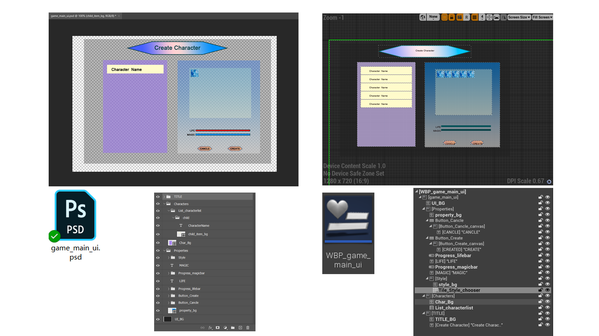

# AutoPSDUIDoc

## Description

AutoPSDUI is a plugin for automatically building WBP when importing PSD into the UE4 editor and it supports many widget types well.

## Features

The  following widget types and  properties supported by AutoPSDUI:

* Canvas Panel

* TextBlock
  * text content;
  * text color;
  * text font;
  * outline;
  * shadow.

*  Image
  * Image export as .png file and import as UE4 assets;
  * Image Brush Tink.

* Button
  * Normal Image;
  * Hovered Image;
  * Pressed Image;

  * Disabled Image;
  * All the features supported by the above image widgets are also supported in the four image paramaters of button widget;
  * child widgets.

*  Progress Bar
  * Background Image;

  * Fill Image;
  * All the features supported by the above image widgets are also supported in the two image paramaters of ProgressBar widget.

* List View
  * Automatically create blueprint assets (with UserObjectListEntry Interface implementation) of child entry widget blueprint.

* Tile View
  * Same with List View.

## PSD Structure Design

If you want to use this plug-in smoothly, you should follow the following rules to design your PS layer:  

### Canvas Panel

* PSD Layer Type: group
* PSD Layer Name Rule: Any, but must not satisfy the group layer name rules mentioned below.
* Child Layer: Any
* Layer Style: No Style

### TextBlock

* PSD Layer Type: type
* PSD Layer Name Rule: Any
* Child Layer: No
* Layer Style: 
  * Stroke: Only Support Normal Blend Mode
  * Drop Shadow: Only Support Multiply Blend Mode

### Image

* PSD Layer Type: Pixel/Shape/SmartObject
* PSD Layer Name Rule: Any
* Child Layer: No
* Layer Style: 
  * ColorOverlay: Only Support Multiply Blend Mode

### Button

* PSD Layer Type: group
* PSD Layer Name Rule: **Button_**  prefix
* Child Layer: Any (Note the following four types of images)
* Layer Style: No
* Normal Image:
  * Layer Type: Same with **Image**
  * Layer Name Rule:   **_normal**   postfix
  * Layer Style: Same with **Image**
* Hovered Image:
  * Layer Type: Same with **Image**
  * Layer Name Rule: **_hovered** postfix
  * Layer Style: Same with **Image**
* Pressed Image:
  * Layer Type: Same with **Image**
  * Layer Name Rule: **_pressed** postfix
  * Layer Style: Same with **Image**
* Disabled Image:
  * Layer Type: Same with **Image**
  * Layer Name Rule: **_disabled** postfix
  * Layer Style: Same with **Image**

### Progress Bar

* PSD Layer Type: group
* PSD Layer Name Rule: **Progress_**  prefix
* Child Layer: The following two types of images.
* Layer Style: No
* Background Image:
  * Layer Type: Same with **Image**
  * Layer Name Rule: **_background** postfix
  * Layer Style: Same with **Image**
* Fill Image:
  * Layer Type: Same with **Image**
  * Layer Name Rule: **_fill** postfix
  * Layer Style: Same with **Image**

### List View

* PSD Layer Type: group
* PSD Layer Name Rule: **List_**  prefix
* Child Layer: Must be one group layer with name **child**
* Layer Style: No
* Child(Will be constructed as a Child WBP with UserObjectListEntry  Implementation) 
  * Layer Type: group
  * Layer Name Rule: child
  * Child Layer: Any

### Tile View

* PSD Layer Type: group
* PSD Layer Name Rule: **Tile_**  prefix
* Child Layer: Same with **List View**
* Layer Style: No
* Child: Same with **List View**

## Contact

Gamil: john.hj.private@gmail.com

GOOD LUCK!